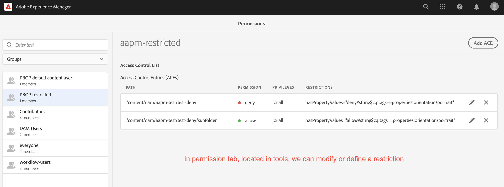
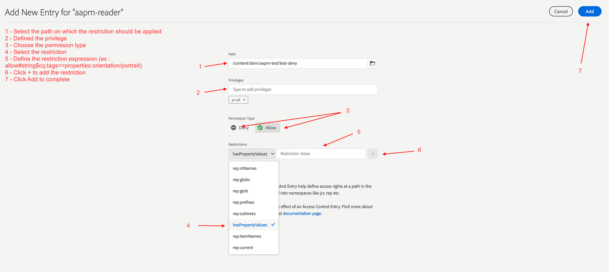
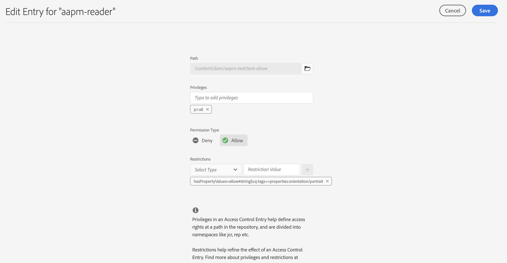
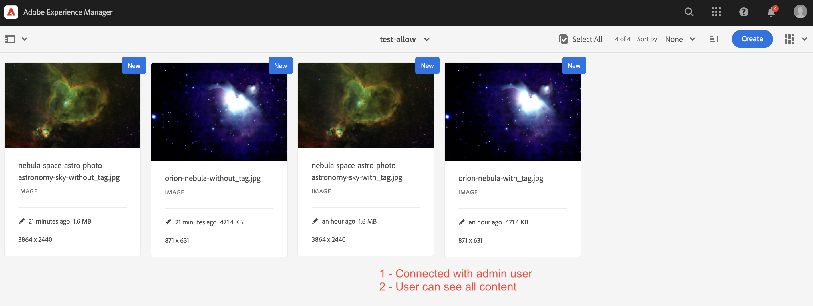
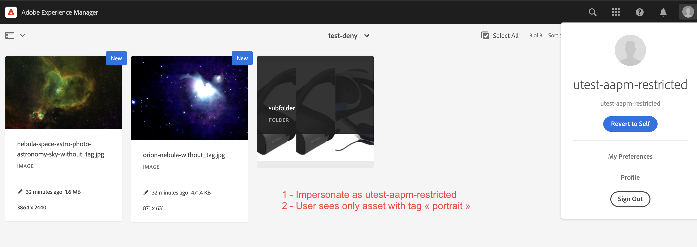
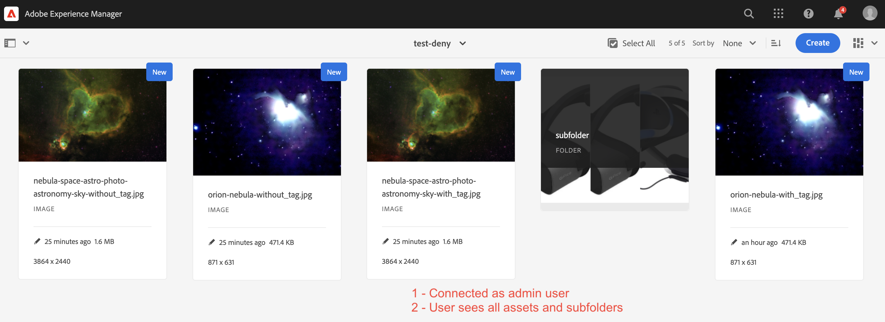
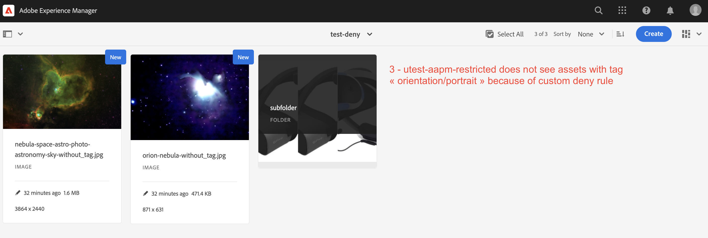
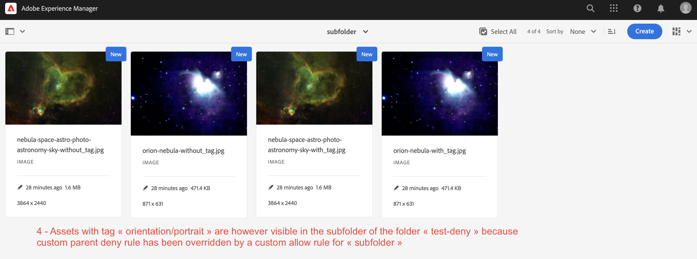

# AEM Advanced Permissions Manager

AEM Advanced Permissions Manager uses custom Oak restriction mechanism to provide a way to apply the permission.
The permission is applied only if the defined condition is met. Currently the main example is to allow/deny access
if an asset owns (or does not own) a tag.

This mechanism can be used to restrict a standard ACL permission for any asset.

# Requirements

AVS requires Java 11, Maven >= 3.6.0 and AEM Cloud.

| AEM Version | AAPM        |
|-------------|-------------|
| Cloud       | 0.0.1-beta2 |
| 6.5         | TO BE DONE  |

# Deploying
There are 2 ways to deploy :
- From sources 
  - See our [developer zone](docs/developers.md)
- From zip/jar files
  - if you want to install predefined assets, users and groups to test quickly => install aapm.all-x.x.x.zip
  - if you want only the feature => install aapm.core-x.x.x.jar

    
### Deploy as maven dependency (not yet implemented):
#### With predefined installed examples
    <dependency>
        <groupId>com.valtech.aapm</groupId>
        <artifactId>aapm.all-x.x.x</artifactId>
        <version>LATEST</version>
        <type>zip</type>
    </dependency>
 or

#### Without predefined installed examples

    <dependency>
        <groupId>com.valtech.aapm</groupId>
        <artifactId>aapm.core-x.x.x</artifactId>
        <version>LATEST</version>
        <type>jar</type>
    </dependency>

## Uninstallation

### Removing following paths
- /conf/aapm
- /content/dam/aapm-test
- /apps/aapm
- /apps/aapm-packages
- /apps/netcentric/actool/config
- /apps/netcentric/actool/config.dev
- /apps/netcentric/actool/config.stage
- /apps/netcentric/actool/config.prod
- /apps/netcentric/actool/install
- /etc/packages/Netcentric

### Deleting users and groups (in /security/users.html)
#### Users  :

- utest-aapm-content
- utest-aapm-reader
- utest-aapm-restricted

#### Delete following groups :

- aapm-content
- aapm-reader
- aapm-restricted

Afterwards, you can delete the AAPM and accesscontroltool packages in package manager.

## Define restriction 
User with the appropriate rights, can define restrictions.

### Build a restriction

A restriction is written like this :

- hasPropertyValues: <restriction_type>#<unary_operator><property_type>$<property_name><binary_operator><property_value>

where :

- <restriction_type> = "allow" or "deny"
- <unary_operator> = "!" or "" (negation or not)
- <property_type> = "int", "date", "string" (*currently only type "string" works well*)
- <property_name> = the name of the asset node property ("cq:tags" for example)
- <binary_operator> = "==", ">=", "<=","<",">" (*currently only "==" works well*)
- <property_value> = the value the property has to be equal to match the restriction

#### Examples :
*Be careful : the permission type (allow or deny) has to be the same than the "restriction type". See examples below.*

##### Example 1 :
- Permission type = "*deny*"
- hasPropertyValues: *deny*#string$cq:tags==properties:orientation/portrait
- For a restriction "R1" defined by the above line applying to a user "UserA", R1 will prevent UserA to access to all
  the assets tagged with orientation/portrait

##### Example 2 :
- Permission type = "*allow*"
- You can "cancel" the restriction of example 2 in a subfolder by adding following line
- hasPropertyValues: *allow*#string$cq:tags==properties:orientation/portrait

##### Example 3 :
- Permission type = "*deny*"
- You can use a "negate operator" :
- hasPropertyValues: *deny*#string$!cq:tags==properties:orientation/portrait
- For a restriction "R2" defined by the above line applying to a user "UserA", R2 will prevent UserA to access to all
the assets not tagged with orientation/portrait

### Restriction through permission tab
 1 - Go to permission tab (Tools/Security/Permission)

 2- Click "Add ACE" and follow instructions 

### Restriction through yaml file
  Yaml file location : apps/aapm/pbop/permissions/groups/pbop-ace-group.yaml

    # Test 1 : with user that has permission to see the all inside test-allow folder
    - aapm-default-reader:
    - path: /content/dam/aapm-test/test-allow
      permission: allow
      actions:
      privileges: jcr:all
      restrictions:
        hasPropertyValues: allow#string$cq:tags==properties:orientation/portrait

    # Test 2 : with user that has NO permission on test-deny but with permission in test-deny/subfolder
    - path: /content/dam/aapm-test/test-deny
      permission: deny
      actions:
      privileges: jcr:all
      restrictions:
        hasPropertyValues: deny#string$cq:tags==properties:orientation/portrait

    - path: /content/dam/aapm-test/test-deny/subfolder
      permission: allow
      actions:
      privileges: jcr:all
      restrictions:
        hasPropertyValues: allow#string$cq:tags==properties:orientation/portrait

## Modify Restriction

 User can modify existing restriction even through yaml or permission tab. 
 - From yaml, just modify your permission file and redeploy. 
 - From restriction tab, go to permission tab (Tools/Security/Permissions) and select the existing group and edit

##Result according to yaml file definition

    # Test 1
    1 - Login as admin user
    2 - Navigate to /content/dam/aapm-test/test-allow folder
    4 - User should see all assets and sub folder
    3 - Unpersonnate as utest-aapm-reader (apps/aapm/pbop/permissions/users/pbop-ace-user.yaml)
    4 - Result : user will only see all assets with the tag properties:orientation/portrait
  
  

    # Test 2
    1 - Login as admin user
    2 - Navigate to /content/dam/aapm-test/test-deny
    3 - User should see all assets and sub folder
    4 - Unpersonnate as utest-aapm-restricted (apps/aapm/pbop/permissions/users/pbop-ace-user.yaml)
    5 - Result : user should see only assets without the tag properties:orientation/portrait in "test-deny" and all asssets in "/subfolder" (because for the group "aapm-restricted" deny access for assets with tag "properties:orientation/portrait" has been overidden by an allow access for "subfolder")
  
  
  

# Developers

See our [developer zone](docs/developers.md).